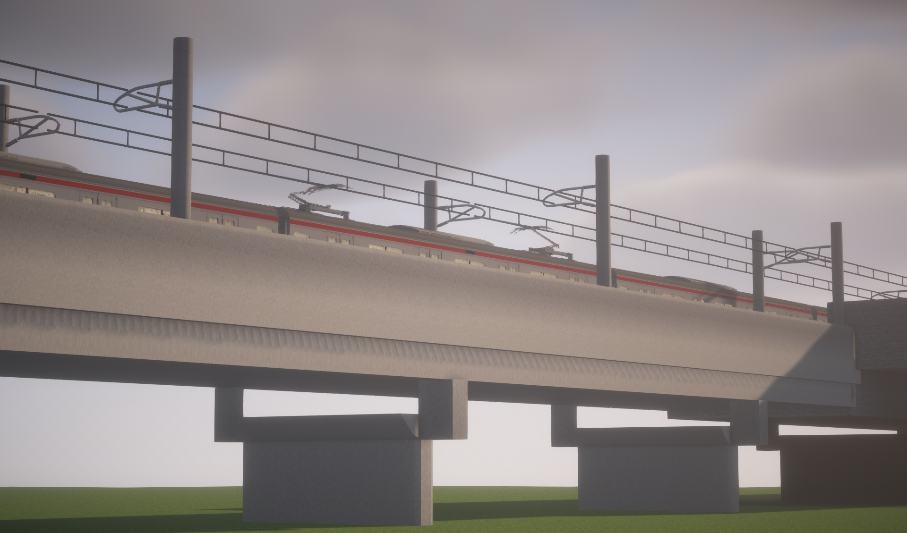
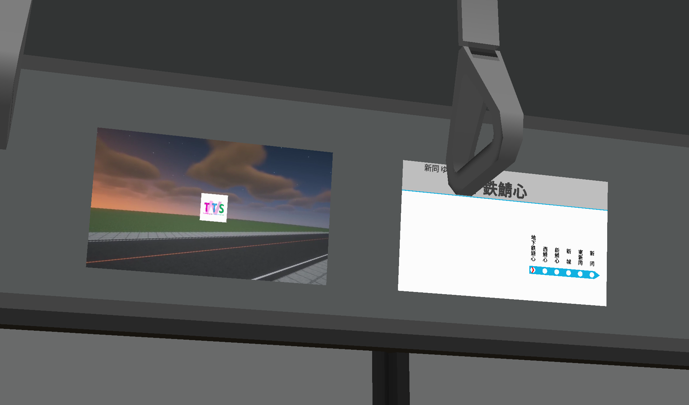

# はじめまして！こんにちは！

- 私は **ねすと** といいます。
- Minecraft Java版で、[Minecraft Transit Railway Mod](https://minecrafttransitrailway.com/)の[アドオンMod](https://nestaida4096.github.io/MTR-ANTE-NEST-Patch-Website/)の開発を行っています。
- 私は**Java**および**JavaScript**がコーディングできます。過去に**Lua**を扱ったことがあります（最近はAIに丸投げすることが多いのですが）。
- 以下の画像は、MTTSという私が管理するサーバーで撮影されたものです。ぜひ見ていってください。

